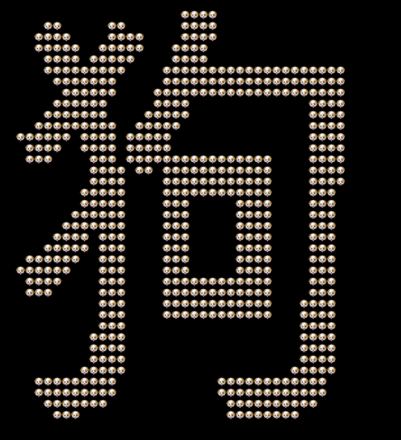

### 介绍

`zh2emoji`可以将一个中文字，在终端输出成由emoji表情组成的该字。

emoji表情可以自己随意定制: ❤️  🐀  🐂  🐅  🐇  🐶  🐱  🐻  ...

也可以将emoji表情替换成ASCII,或者中文,或者其他(Just Try It)

比如执行以下几行代码, 使用不同的填充方法显示来展示"酱"字:

    print image2print(word2image(u'酱'), u'❤️ ')
    print image2print(word2image(u'酱'), u'W ')
    print image2print(word2image(u'酱'), u'酱', width=40)

其中, 对于ascii 建议后面多一个空格填充;

对于emoji表情, 可能跟终端的打印方式有关, 对比后自行决定后面需不需要加上空格填充;

对于中文,输出正好.

输出结果如下:

更多输出:

## 扩展

基于zh2emoji，自己实现了一个可能有点儿用的扩展: `demo_show_animation.py`.

它可以将一句话在终端依次打印出来,使用你决定的emoji或者其他字符.

比如你试着执行 `python ./demo_show_animation.py 喜欢就点个赞呗`, 将在终端执行一段展示文字的动画, 展示的文字就是你刚才输入的话.

zh2emoji 还支持更换字体,不过在终端打印出来也差别不大.

## 其他

如果你对这有兴趣, 而且有一些有意思的建议, 如果我能够实现, 我会在后续中贡献出更加有趣的内容.

Come On! 有的话可以联系我: hongxucai1991@163.com
